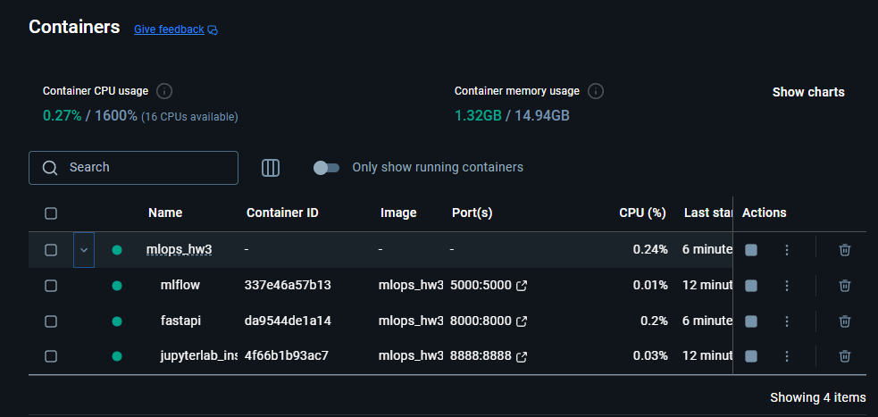

# Homework 3
 
## Docker compose setup
```commandline
docker-compose up --build -d
```
Docker Desktop UI:



## Mlflow link
- Access with [http://localhost:5000](http://localhost:5000)
  

## Miniio Object Storage
- Access with [http://localhost:9001](http://localhost:9001)
  

## Jupyterlab link
- Access with [http://localhost:8888?token=easy](http://localhost:8888?token=easy)
- Run `mlflow/notebooks/train_and_register_model.ipynb` to train and register model in mlflow
- Model should be in mlflow after 
  
  

## Test Fastapi endpoint
- Run `mlflow/notebooks/predict.ipynb` to predict
  

## Cleanup
```commandline
docker compose down
```
  