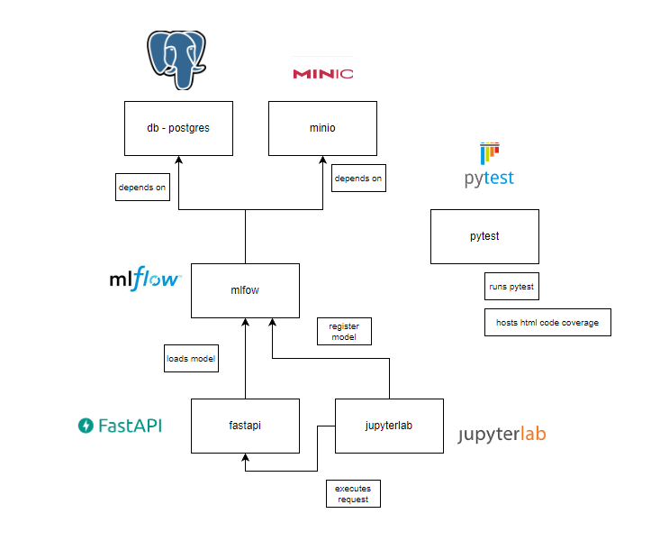

# Directory Structure
- `dockefiles`
  - dockerfiles per container defined here
- `images` - images used for markdown documentation
- `fastapi_dir` - source directory for fastapi code
- `mlflow_dir` - source directory for mlflow code and notebooks for jupyterlab container
- `tests` - tests folder
  - `fastapi` - tests `fastapi_dir` src
  - `mlflow` - tests `mlflow_dir` src

# Docker Containers Architecture
